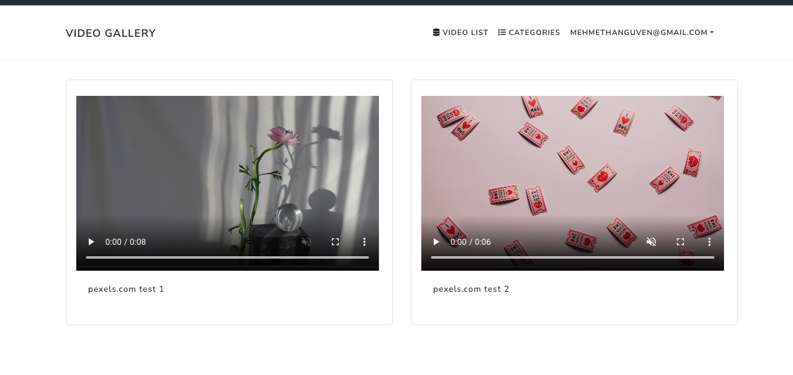
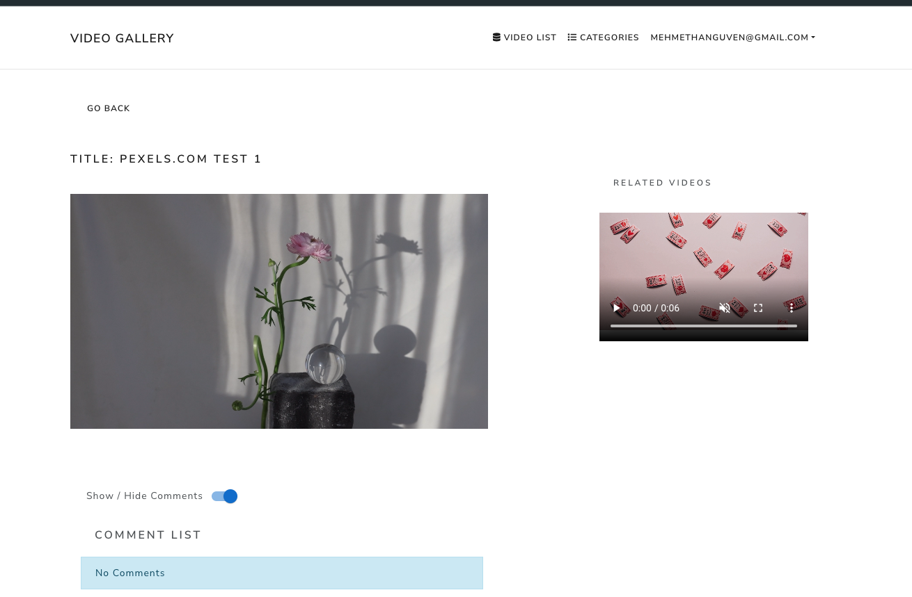

# Video Gallery

Video Gallery Full Stack (Reactjs - Redux - Redux Toolkit - Python - Django - PostgreSQL - React Bootstrap)

## Author

Mehmethan Guven
<br/>
<a href='mailto:mehmethanguven@gmail.com<'>mehmethanguven@gmail.com</a>

## Some Screenshots




## Support

If you like you can give a star.

## Getting Started

**SERVER**

1. **Sqlite / PostgreSQLM**

2. **Django**

3. **Python**

**CLIENT**

1. **ReactJS**

2. **Redux**

3. **Redux Toolkit**

### Server Configuration

### Installation

1. Clone this repository by running

```js
git clone https://github.com/mehmethanguven/reactjs-django-video-gallery.git
```

2. Backend

```js
 in the backend directory
 python3 -m venv venv
 source venv\scripts\activate
 pip install -r requirements.txt
 make migration
 python manage.py createsuperuser
 python manage.py runserver

```

3. Frontend

```js
in the frontend directory
yarn
yarn start
```

'http://localhost:3000'
